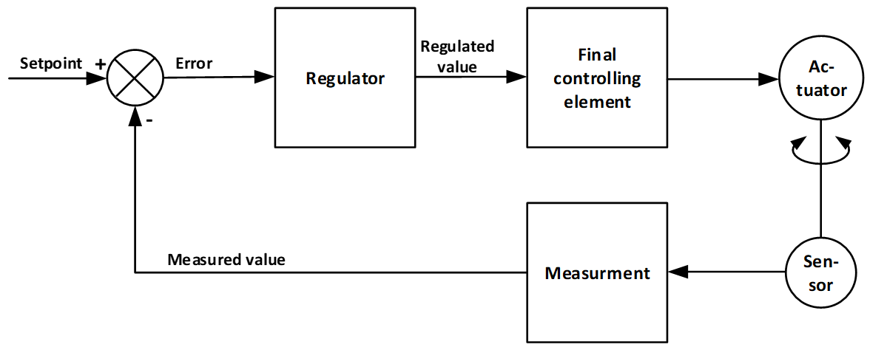

# Introduction

The main goal for this assignment is to learn and perform the basic steps needed to implement a system-on-chip (SoC). 
In this context the implementation will use the on Zynq ARM processor core together with the FPGA fabric on the Zedboard. 
The SoC system will be consisting of both hardware modules written in an HDL and a processing system running software written using C code. 
As a secondary objective, the basic function of a PID control is presented.

The HDL system that shall be coupled with the processing system is the control system written in oblig 8. 
The HDL code will only require minor adjustments to provide the necessary IO to be connected with the IP-core that can be accessed by the processing system. 
To connect the HDL system to the processor bus, we will use an IP (AXI-GPIO) that handles all the bus protocols. 

The C code that will run on the processor in this assignment is premade and lies in the [src](./src) folder. 
The processing system will provide PID regulated values based on the output of the HDL module. 

Making a full system on chip can be a daunting task the first time it is performed. 
Several process steps will have to be performed in order to create the necessary environment that can be used to create nearly any combination of software and hardware. 
To aid this process we will use four tutorials that will take us through the necessary steps to build our system. 

The tutorials for this task is built upon AMD/Xilinx Embedded design tutorials, modified to function with our setup and infrastructure.
Links to the current AMD/Xilinx tutorials are provided for reference. 
Reading these may provide additional insight and up to date information on the process. 

## General control system

A block diagram of a control system may be something like the one used in assignment 8:

|  |
|:---:|
| General control system |

In that assignment, you made the final controlling element (the pulse-width module), and used it to set the output directly. 
In this assignment, the regulated value shall be provided by a PID module provided as C code that can run on the Zynq processor once the system is properly set up and programmed.    

## Building a processor system in an FPGA
Building a processor system in an FPGA is a bit more complex than using a microcontroller or using the CPU of a PC. 
There are basicly two reasons for this:
1. An FPGA implementation is usually used in a highly customized context, where the periphery of the microcontroller may vary a lot.
   * To be useful, the tools have to accomodate this customization which adds complexity.
2. The economy of scale
   * Compared to PCs, android, apple and arduino, the user base of Xilinx is smaller.  
     This result in slower rate of development and slow tool evolution.
     This does not mean that the tools are incapable, but processes may be less streamlined.
        
To build a system that both uses our circuit and a processor system, we will have to complete a set of steps that are about as follows:

1. **Make your design a custom IP**
   * Ie. compile and synthesize our design in a way that allows us to connect our system to the processor system later.
   * _This step is performed in Vivado._
2. **Build a block design** that combines the Zynq processor and IPs required to connect to our control system.
   * _This is done in Vivado._
3. **Export a hardware environment** that allows the software tool to program the arm core (Zynq processor) in the FPGA on the Zedboard.
   * This must be done, even for the simplest programs.
   * _This step is performed in vivado._
4. **Build a software environment platform** that allow software applications to run on the Zynq processor.
   * _This step is performed in Vitis._
5. **Build a software application** that runs on the Zynq processor.
   * The software that shall be run is a premade PID controller.
      * You will be able to modify this at will, but this is not required.
   * _This step is performed in Vitis._

The three last parts can be tested using the _Hello World_ example in the AMD/Xilinx tutorials. 
These can be used to become familiarized with the tool and the process, before using your own IP. 
          
> [!NOTE]
> The IP integration does not fully support VHDL2008, and you will be warned about this throughout the process.
> As long as the top layer entity uses `std_logic`, `std_ulogic` and their vectors, and the architecture is purely structural, these warnings can safely be ignored[^1].

 [^1]: To create a functional IP, it is required that the toplevel can be used for connections, and that the components has been synthesized. 
    Once all components are synthesized, and the toplevel has an interface that the tool understands, there is no VHDL2008 left to confuse vivado or vitis.
  
[Back](./readme.md)   
